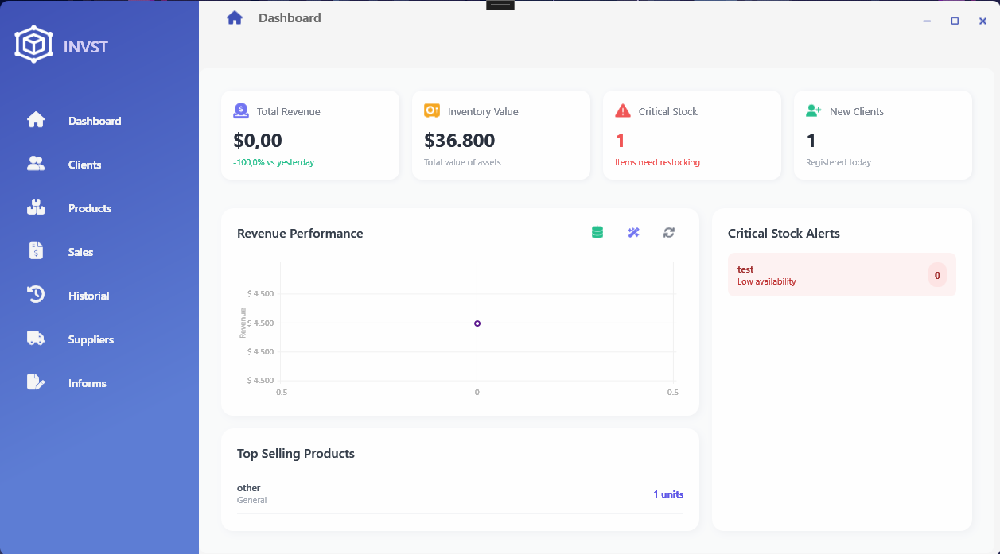

# 📦 Inventory Management System

> A modern, Desktop Inventory and Point of Sale (POS) system built with WPF and .NET 8

[](https://dotnet.microsoft.com/)
[](https://docs.microsoft.com/en-us/dotnet/desktop/wpf/)
[](https://www.sqlite.org/)
[](https://github.com/yourusername/InventorySystem/releases)
[](https://github.com/yourusername/InventorySystem)
[](https://github.com/yourusername/InventorySystem/graphs/commit-activity)


---

## Project Overview

A comprehensive inventory management solution designed for small to medium-sized businesses. Built with modern software architecture patterns including **MVVM**, **Dependency Injection**, and **Repository Pattern** to ensure maintainability, scalability, and testability.

### Key Highlights

- 📊 **Real-time Analytics Dashboard** with interactive charts
- 🛒 **Complete POS System** with transaction management
- 📄 **Professional PDF Invoicing** with QuestPDF
- 💾 **Robust Data Management** with Entity Framework Core
- 🎨 **Modern UI/UX** with design aesthetics implemented using WPF
- ✅ **Input Validation** with real-time feedback
- 🔄 **Active/Inactive Status Management** for all entities

---

## Why a Desktop Application?

While many systems today are cloud-based, this project intentionally focuses on a **desktop-first approach** to ensure:
- Full offline operation
- Local data ownership
- Immediate responsiveness
- Business continuity during service outages

This system is designed to later integrate with a cloud service via a synchronization bridge.


##  Screenshot

### Dashboard
> Real-time KPIs, revenue charts, and critical stock alerts


*Main dashboard showing sales analytics, inventory value, and top-selling products*

---

##  Features

###  Inventory Management
- ✅ Real-time stock tracking with automatic deduction on sales
- ✅ Product catalog with categories, prices, and descriptions
- ✅ Visual status indicators (In Stock, Out of Stock, Inactive)
- ✅ Low stock alerts with critical item notifications
- ✅ Bulk operations and filtering

###  Customer Management
- ✅ Comprehensive customer profiles with contact details
- ✅ Excel/CSV import using MiniExcel for bulk data entry
- ✅ Active/Inactive status management
- ✅ Transaction history per customer
- ✅ Support for anonymous "General Public" sales

###  Supplier Management
- ✅ Full CRUD operations for supplier records
- ✅ Company details and contact information
- ✅ Category-based organization
- ✅ Active/Inactive status tracking

###  Point of Sale (POS)
- ✅ Dynamic shopping cart with real-time calculations
- ✅ Product search and quick selection
- ✅ Customer assignment (registered or anonymous)
- ✅ Atomic transactions ensuring data integrity
- ✅ Instant stock updates upon sale completion

###  Analytics Dashboard
- ✅ Daily sales revenue with trend analysis
- ✅ Total inventory value calculation
- ✅ Critical stock alerts (items below threshold)
- ✅ New customer tracking
- ✅ Top-selling products visualization
- ✅ Interactive revenue performance charts
- ✅ Sample data generation for demonstrations

###  Sales History & Reporting
- ✅ Complete transaction history browser
- ✅ Detailed order views with line items
- ✅ Professional PDF invoice generation
- ✅ Real-time financial summaries
- ✅ Export capabilities

###  User Experience
- ✅ implemented using WPF styles, resource dictionaries, and MVVM bindings
- ✅ Input validation with real-time visual feedback
- ✅ Smooth animations and transitions
- ✅ Responsive layout design
- ✅ Intuitive navigation with FontAwesome icons

---

##  Technology Stack

### Core Technologies
- **Framework**: .NET 8 (WPF)
- **Language**: C# 12
- **Architecture**: MVVM Pattern
- **Database**: SQLite with Entity Framework Core 8
- **Dependency Injection**: Microsoft.Extensions.DependencyInjection

### Libraries & Packages
- **UI Components**: 
  - FontAwesome.Sharp (Icons)
  - LiveCharts.Wpf (Data Visualization)
  - HandyControl (Modern Controls)
- **PDF Generation**: QuestPDF
- **Data Processing**: MiniExcel
- **ORM**: Entity Framework Core

### Design Patterns
- ✅ Model-View-ViewModel (MVVM)
- ✅ Repository Pattern
- ✅ Dependency Injection
- ✅ Command Pattern
- ✅ Observer Pattern (INotifyPropertyChanged)
- ✅ Service Layer Architecture

---

##  Project Architecture

```
InventorySystem/
├── 📁 Models/              # Domain entities (Product, Client, Sale, etc.)
├── 📁 ViewModels/          # MVVM ViewModels with business logic
├── 📁 Views/               # XAML UI components
├── 📁 Services/            # Business logic and data access layer
│   ├── ProductService.cs
│   ├── ClientService.cs
│   ├── SaleService.cs
│   ├── SeedDataService.cs
│   └── Export/
│       └── PdfService.cs
├── 📁 Data/                # Database context and configurations
│   └── AppDbContext.cs
├── 📁 Commands/            # ICommand implementations
├── 📁 Converters/          # Value converters for data binding
├── 📁 Helpers/             # Utility classes and behaviors
├── 📁 Assets/              # Images, icons, and styles
│   └── Styles/             # XAML resource dictionaries
└── 📁 Shell/               # Main window and splash screen
```

### Layered Architecture

```
┌─────────────────────────────────────┐
│         Presentation Layer          │
│    (Views + ViewModels + XAML)      │
├─────────────────────────────────────┤
│         Business Logic Layer        │
│      (Services + Commands)          │
├─────────────────────────────────────┤
│         Data Access Layer           │
│   (Repositories + EF Core Context)  │
├─────────────────────────────────────┤
│           Database Layer            │
│         (SQLite Database)           │
└─────────────────────────────────────┘
```

---

## 🚦 Getting Started

### 📥 Download & Install (Recommended)

**For End Users - No Development Tools Required:**

1. **Download the latest release**
   - Go to [Releases](https://github.com/yourusername/InventorySystem/releases)
   - Download `InventorySystem-v1.0.0-win-x64.zip`

2. **Extract the ZIP file**
   - Right-click → Extract All
   - Choose a location (e.g., `C:\InventorySystem`)

3. **Install (Easy Method)**
   - Right-click on `install.ps1`
   - Select "Run with PowerShell"
   - Follow the prompts
   - Launch from Desktop shortcut

   **OR Manual Method:**
   - Simply run `InventorySystem.exe`

> **Note**: No .NET installation required! Everything is included.

---

### 🛠️ Build from Source (For Developers)

**Prerequisites:**
- [.NET 8 SDK](https://dotnet.microsoft.com/download/dotnet/8.0) or later
- Visual Studio 2022 (recommended) or Visual Studio Code
- Windows 10/11

**Steps:**

1. **Clone the repository**
   ```bash
   git clone https://github.com/yourusername/InventorySystem.git
   cd InventorySystem
   ```

2. **Restore dependencies**
   ```bash
   dotnet restore
   ```

3. **Build the project**
   ```bash
   dotnet build --configuration Release
   ```

4. **Run the application**
   ```bash
   dotnet run --project InventorySystem
   ```

   Or open `InventorySystem.sln` in Visual Studio and press F5.

---

### 📦 Create Release Package (For Maintainers)

To create a distributable package for GitHub Releases:

```powershell
.\create-release.ps1 -Version "1.0.0"
```

This will:
- Build the project in Release mode
- Create a self-contained package
- Generate a ZIP file in `releases/`
- Create release notes

Upload the generated ZIP to GitHub Releases.

---

### First Run

On the first launch, the application will:
- ✅ Automatically create the SQLite database (`inventory.db`)
- ✅ Apply all Entity Framework migrations
- ✅ Initialize the database schema

**Optional**: Use the "Generate Sample Data" button (magic wand icon) on the dashboard to populate the database with demo data for testing.

---

##  Usage Guide

### Adding Products
1. Navigate to **Products** from the sidebar
2. Click **Add Product** button
3. Fill in product details (name, category, price, stock)
4. Optionally add a product image
5. Set initial status (Active/Inactive)
6. Click **Save**

### Making a Sale
1. Go to **Sales** view
2. Select a customer or use "General Public"
3. Search and add products to cart
4. Review cart items and total
5. Click **Complete Sale**
6. Generate PDF invoice if needed

### Viewing Analytics
1. Open **Dashboard** (default view)
2. View real-time KPIs at the top
3. Analyze revenue trends in the chart
4. Check critical stock alerts on the right
5. Use **Refresh** button to update data
6. Use **Database Stats** to verify record counts

### Importing Customers
1. Navigate to **Clients** view
2. Click **Import** button
3. Select Excel/CSV file with customer data
4. Review imported records
5. Confirm import

---

##  UI/UX Features

### Modern Design Elements
- **Glassmorphism Effects**: Subtle transparency and blur for depth
- **Smooth Animations**: Transitions between views and state changes
- **Color-Coded Status**: Visual indicators for stock levels and entity states
- **Responsive Layout**: Adapts to different window sizes
- **Premium Typography**: Clean, modern fonts for readability

### Input Validation
- **Real-time Feedback**: Instant validation as you type
- **Visual Indicators**: Red borders and error messages for invalid input
- **Type Restrictions**: Numeric-only fields, letter-only fields, phone format
- **Required Field Enforcement**: Prevents submission with missing data

### Interactive Charts
- **Revenue Performance**: Line chart showing sales trends over time
- **Top Products**: Visual representation of best-sellers
- **Stock Alerts**: Color-coded warnings for low inventory

---

##  Configuration

### Database Connection
The application uses SQLite by default. Connection string is configured in `AppDbContext.cs`:

```csharp
options.UseSqlite("Data Source=inventory.db");
```

### Customization
- **Styles**: Modify XAML resource dictionaries in `Assets/Styles/`
- **Colors**: Update color schemes in style files
- **Business Rules**: Adjust validation logic in ViewModels and Services

---

##  Code Quality

### Best Practices Implemented
- ✅ **SOLID Principles**: Single Responsibility, Open/Closed, Dependency Inversion
- ✅ **Async/Await**: Non-blocking UI operations
- ✅ **Error Handling**: Try-catch blocks with user-friendly messages
- ✅ **Data Validation**: Both client-side and model-level validation
- ✅ **Separation of Concerns**: Clear boundaries between layers
- ✅ **Dependency Injection**: Loose coupling and testability

### Code Structure
- **ViewModels**: Implement `INotifyPropertyChanged` for data binding
- **Services**: Interface-based for easy mocking and testing
- **Commands**: Reusable `ICommand` implementations
- **Converters**: Custom value converters for complex bindings

---


##  Author
- GitHub: [@Andrea2301](https://github.com/Andrea2301)

---

##  Acknowledgments

- FontAwesome for the comprehensive icon library
- LiveCharts for beautiful data visualization
- QuestPDF for professional PDF generation
- The .NET community for excellent documentation and support

---

##  Contact

For questions or feedback, please reach out via [andreaospino323@gmail.com](mailto:andreaospino323@gmail.com)

---

<div align="center">
  <p>Made with ❤️ using .NET 8 and WPF</p>
</div>
